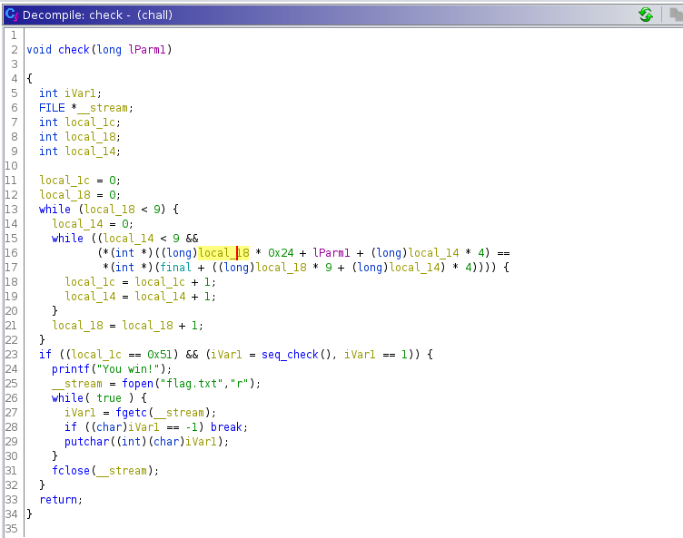

# XOXO

### Challenge Description
During the early days of Apollo, software was not taken as seriously as other engineering disciplines. Though in fact we had a complex system of systems, we weren’t getting credit for what was a legitimate field. It was out of desperation I came up with the term, to say: “Hey, we’re engineering too.”

Lets play by my rules.

### Writeup

The game does not let the player play at anyposition also does not let the server play at any position. But finally a pattern is achieved once all positions are filled but again this has to be achieved in a certain sequence which is to be obtained deom the final check matrix function which checks if the input sequence was in this order : l=[7,51, 3, 73, 71, 2, 35, 77, 6, 79, 26, 38, 53, 27, 44, 78, 45, 21, 36, 33, 59, 29, 17, 5, 56, 42, 24, 47, 18, 9, 74, 20, 75, 54, 23, 22, 60, 63, 57, 1, 62]

Initially you need to open the binary using [ghidra](https://ghidra-sre.org/) and open the disassembly view using the code browser from ghidra. 

On the left side you can see the symbol table where every function from the program is listed and from there you can search for the main function to get the starting point of the program.

As you go through the program you can see the other functions and from the names of the function you can see that there is a function called the seq_check which sounds fishy. And if you go through it you can see a check.

 

here the sequence array is hard coded and on xoring these values with 0x1337 you get the sequence in which you should give your input. 

### Script 

```python 
from pwn import *
user_seq = ['8', '52', '4', '74', '72', '3', '36', '78', '7', '80', '27', '39', '54', '28', '45', '79', '46', '22', '37', '34', '60', '30', '18', '6', '57', '43', '25', '48', '19', '10', '75', '21', '76', '55', '24', '23', '61', '64', '58', '2', '63']

#user_seq = ['7', '51', '3', '73', '71', '2', '35', '77', '6', '79', '26', '38', '53', '27', '44', '78', '45', '21', '36', '33', '59', '29', '17', '5', '56', '42', '24', '47', '18', '9', '74', '20', '75', '54', '23', '22', '60', '63', '57', '1', '62']
#io=process("./a.out")
io= remote("0.0.0.0", 1111)
for i in range(len(user_seq)):
    print("running "+str(i))
    io.recv()
    io.sendline(bytes(user_seq[i],'utf-8'))
print(io.recvall())

``` 

Flag is obtained when sequence is achieved.

### Flag
shaktictf{XOXO_g0n3_to0_f4r_??_XD}


