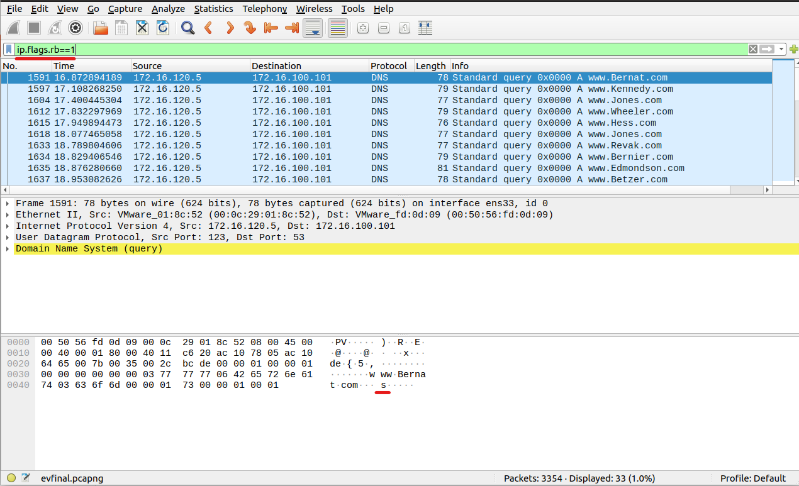

# Follow the malice

## Challenge Description 

My friend has been sending me some wierd site names.But I think she is trying to tell me something. Can you figure it out?

## Write up

- Open the pcap in wireshark
- Filter out the `evil` packets by applying the filter `ip.flag.rb==1` 
- On analysing the filtered packets, at the end of each query name we can see the flag
- 

## Flag 

shaktictf{be1ng_ev1L_hAs_a_pr1ce}

## Author 
[rayst4rk](https://twitter.com/rayst4rk)
