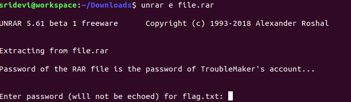

# Mission 2 

### Challenge Description

What was the confidential information that he was going to leak before getting fired?

### Challenge Author

[v1Ru5](https://twitter.com/SrideviKrishn16)

### Writeup

This is the continuation of Mission 1. Using pslist plugin gives us a clue about the processes running in the system at the time of memory capture i.e Command Prompt (conhost.exe) and Internet Explorer (iexplore.exe).

```
volatility -f Challenge.raw --profile=Win7SP1x64 pslist
```

 

Let's try to see the commands entered by the user using cmdscan.

 

We get a base64 encoded string that gives us the word "victory" after decoding. This can be a password/key that might be required in this challenge. Since we see a command "type hint.txt" entered in the command prompt, let's extract the output of this command using consoles plugin.

 

We get another string "p4sSworD@51073#912". We have already noticed that the user opened Internet Explorer at the time of image capture. So let's now use iehistory plugin.

 

We get a locked pastebin link. Unlocking it using "p4sSworD@51073#912" directs us to a password protected RAR file. The password of the RAR file is same as the password of TroubleMaker's account i.e "londonbridge". 

 

We get the flag by decrypting the string present in flag.txt using Vigenere Cipher Decoder and using "victory" as the key.

### Flag

shaktictf{y4Yyy!_M1S5i0n_4cCoMpL1sH3D}


