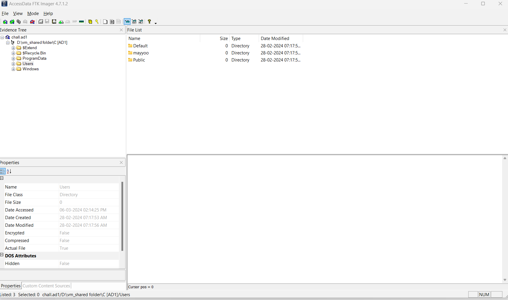
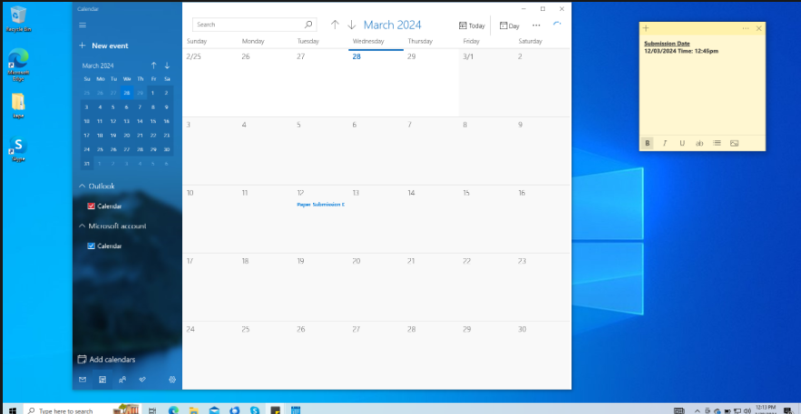

 # Machevillian

**Description** :
Freddy Mileman, a research student sought guidance from his Professor for his impending research paper submission. Subsequently, he received a file from an individual claiming to be the Professor's associate. Upon opening the file, the command line unexpectedly launched. Suspecting potential cybercrime activity, Freddy promptly contacted his friend to assess the situation and mitigate any potential risks.
 
```
Help find the following:

Q1)The name of the person that Freddy is trying to contact in regards of his research paper.

Q2)The submission date of Freddy's Research paper that he had specifically noted on his desktop.

Q3)The name of the downloaded file that looked suspicious.
```

**Author: [hrippi.x_](https://twitter.com/hrippix_)**

**Solution**:

Open the chall file 'chall.ad1' using FTK Imager.


After going through the evidence provided we can conclude that Skype might be the means of communication platform that Freddy might have used as it is also shown in the most recently used folder.

To go through his chats go through the path:
```
C\Users\mayyoo\AppData\Roaming\Microsoft\Skype for Desktop\IndexedDB\file__0.indexeddb.leveldb\000030.ldb
```

Extract the file and use a text editor and go through it as all we want is the text info.

```
"Hello.Mr Mileman I am an associate of Prof. Simon Clarke I was told to give u some suggestions on your report .I shall sent you the corrections in a document please go through it and make the required changes."
```
From the above conversation it is clear that an unknown person tried to contact Freddy under the pretext of being an associate of `Professor Simon Clarke`.

Here we go the 1st part of the chall.

Going through the file you will realize that an screenshot has been saved in OneDrive of the user in the path:

```
\Users\mayyoo\OneDrive\Pictures\Screenshots\2024-02-08.png
```


The second part of the flag: `12/03/2024/12/45`

Going through the recent docs file it can be found in the path 

```
\Users\mayyoo\AppData\Roaming\Microsoft\Windows\Recent
```
we can find a macro enabled file which looks suspicious and which was sent to him by the same unknown contact which can be seen in the previous logs of Skype.

Third flag
`Corrections.docm`

### Flag
```shaktictf{simonclarke:12/03/2024/12/45:corrections.docm}```
