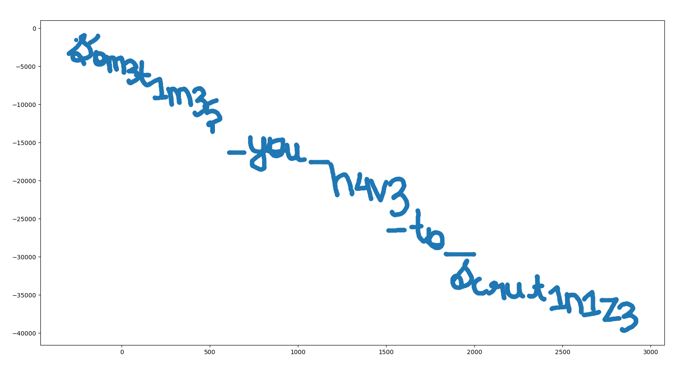
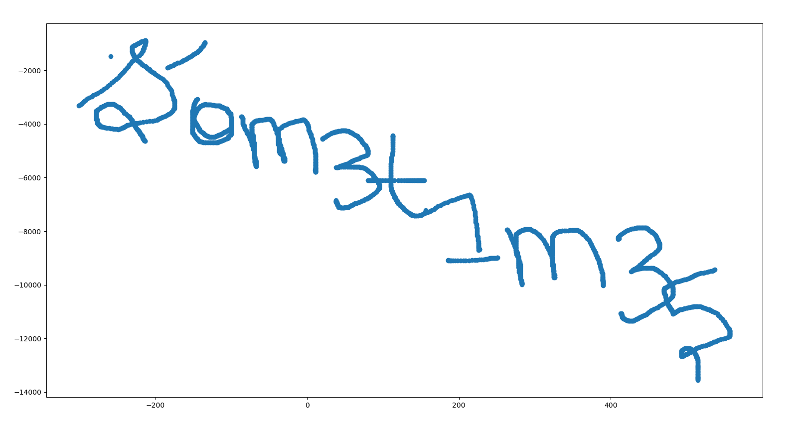
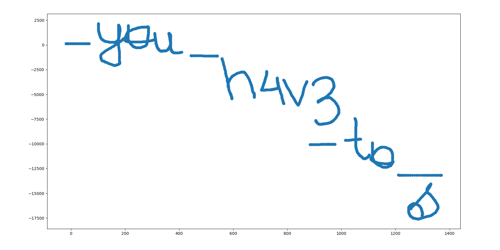
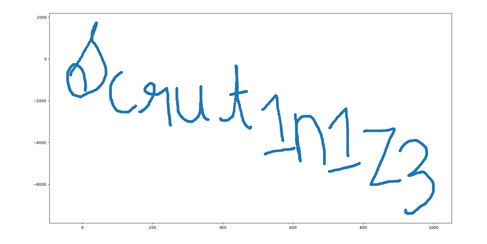

# Packet Prowler

**Description**
Emma works at a multinational corporation (MNC) as a Network Analyst. She was conducting a network capture and attended a meeting, leaving her laptop unattended. Her colleague, Elliot, looked into Emma's laptop and hid a message while the network capture was ongoing. Emma managed to capture the network traffic. Can you help Emma find the hidden message?

**Author: [__m1m1__](https://twitter.com/__m1m1__1)**

**Solution**
Extract the bt-att packets of len 18 into separate pcap, 
where the btatt value of 
1st byte is taken as a mouse click, 
2nd byte is taken as x-coordinate, 
3rd byte is taken as y-coordinate,
by implementing this in the code, the script will take the att value of each packet, put the x and y coordinates in a list, and plot the coordinates using matplotlib where you can see the hidden message.


### Script:
```py
from scapy.all import *
import matplotlib.pyplot as plt

PosX = 0
PosY = 0
X_list = []
Y_list = []
frames = rdpcap("att.pcapng")  #att.pcapng have att packets of only len 18

for i in range(0,8146):
    packet = frames[i]
    data_bytes = raw(packet)
    data_int = int.from_bytes(data_bytes, "big")
    data_hex = hex(data_int)[-12:]
    data_bytes = bytes.fromhex(data_hex)

    mouse_click = data_bytes[0]
    x_coordinate = data_bytes[1]
    y_coordinate = data_bytes[2]

    if x_coordinate > 127:
        x_coordinate -= 256          
    if y_coordinate >= 127:
        y_coordinate -= 256

    PosX += x_coordinate
    PosY += y_coordinate
    
    if mouse_click:
        X_list.append(PosX)
        Y_list.append(-PosY)

fig = plt.figure()
ax1 = fig.add_subplot()
ax1.scatter(X_list, Y_list)
plt.show()
```

Plotted message:


You can also give a certain range of packets in the script to get clear text separately.

Ranges for each text:
range(0,3000): som3t1m35



range(3000,6000):_you_h4v3_to_



range(5700,8146):scrut1n1z3



Flag: `shaktiCTF{som3t1m35_you_h4v3_to_scrut1n1z3}`