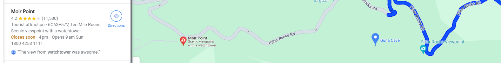
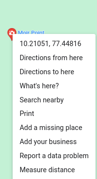

# Tempo_Twist

**Description**
Last year, me and my family went on a trip. There was a watchtower nearby. Can you find the coordinates of the location of the watchtower? All I remember is the place's connection to this song.

Note: If the coordinates were (18.431957575736746, 134.77852817528785), the flag should have the next three digits of the coordinates after the decimal.

Sample Flag Format: shaktictf{18.431,134.778}

Please avoid any spaces in the flag.

**Author: [__m1m1__](https://twitter.com/__m1m1__1)**

**Solution**
 I searched the given lyrics on Google and found the full song of the given audio.

In the description, it was mentioned the "place's connection to this song," so when searched for 'Kanmani anbodu song-related location" and found the 'Guna caves'

It was also given in the description that nearby there was a watch tower. When searching for a watch tower near Guna Caves, the map got this location: 'Moir Point'.

Take the coordinates.
"10.210508973013074, 77.4481630275408," and by modifying it according to flag format, the coordinates were
10.210,77.448

Flag: `shaktictf{10.210,77.448}`